# EduSpace: Educational Resource Management System

`EduSpace (ES)` is a **full-stack web application** developed as a Final Formation Project for the **2025/2026** academic year, created to obtain the diploma of **Advanced Technician in Marketing and Multimedia**.
It modernizes the administrative and resource management processes within educational institutions in **Tunisia**, providing a **centralized platform** for managing classrooms, equipment, reservations, and documents—replacing inefficient, traditional manual methods.

Developed by **Youssef KAABECHI** at the **Sectoral Training Center in Telecommunications (CSFT)** in partnership with **TSE Consultant INT**.

---

## 📚 Table of Contents

- Features
- User Roles
- Screenshots & Previews
- System Architecture & Diagrams
- Tech Stack
- Prerequisites
- Installation
- Usage
- Future Perspectives
- Contributing
- License

---

## 🚀 Features

Based on the **Agile Scrum methodology**, EduSpace delivers a comprehensive set of features identified in the product backlog:

- **👤 Secure Authentication**: Robust login system with email/password and a "Forgot Password" recovery feature.
- **🔐 Role-Based Access Control**: Granular permissions for different user types, managed with the `spatie/laravel-permission` package.
- **🏢 Resource Management**: Full CRUD (Create, Read, Update, Delete) operations for managing rooms and equipment.
- **👥 Profile & Account Management**: Users can create, view, and update their personal profile information.
- **🗓️ Advanced Reservation System**:
  - Teachers can create detailed reservation requests for rooms and equipment.
  - Lab Managers have the authority to review, approve, or reject these requests.
- **📅 Interactive Calendar**: A dynamic calendar provides a real-time view of room and equipment availability, with color-coded reservation statuses.
- **📄 Document Management**: Teachers can upload and share course materials, and students can easily view and download them.
- **🔔 Real-Time Notifications**: Users receive notifications for important events, such as reservation status changes.
- **🎨 Dual Theme UI**: A modern user interface with both Light and Dark modes for enhanced visual comfort.

---

## 👥 User Roles

The application is designed to serve four distinct user roles, each with specific functionalities:

1.  **Administrator** — Possesses full system control. Responsibilities include managing all user accounts, defining roles and permissions, and performing CRUD operations on all physical resources like rooms and equipment.
2.  **Teacher** — Uses the platform for daily pedagogical tasks. Can manage their personal profile, create reservations for rooms and equipment, and upload/manage course documents for students.
3.  **Student** — Primarily a consumer of information. Can manage their profile, and is able to consult and download educational resources shared by their teachers.
4.  **Lab Manager** — A specialized manager for specific resources. This role is responsible for validating, approving, or rejecting reservation requests for laboratories and their associated equipment.

---

## 🖼️ Screenshots

Here are some screenshots of the application:

| Feature              | Screenshot                                           |
| -------------------- | ---------------------------------------------------- |
| Login Page           | 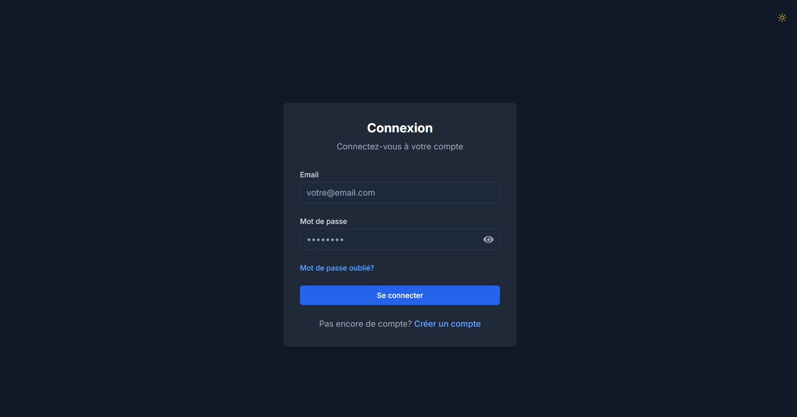             |
| Dashboard            | 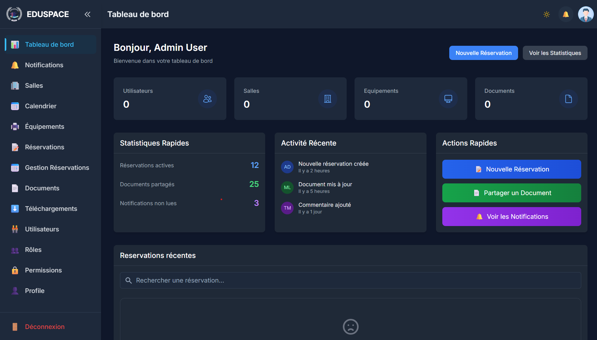          |
| Room Reservation     | 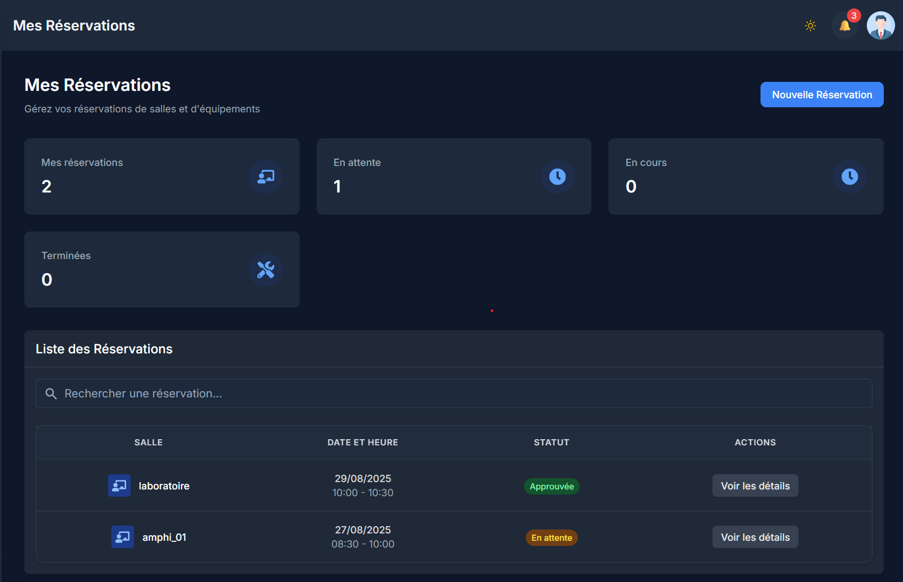 |
| Calendar             | 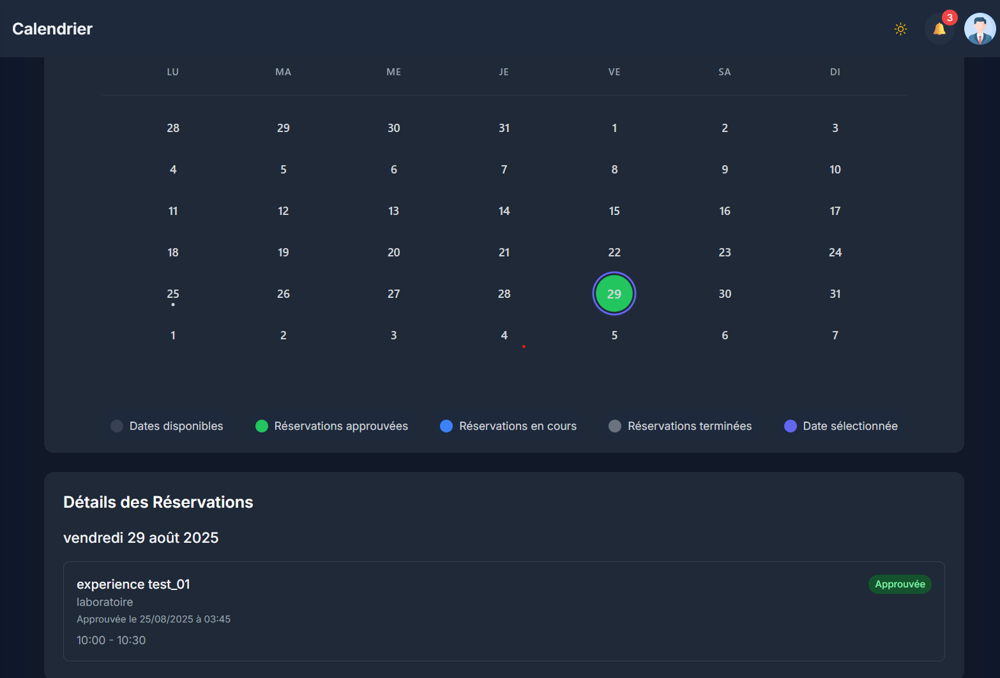            |
| Profile              | 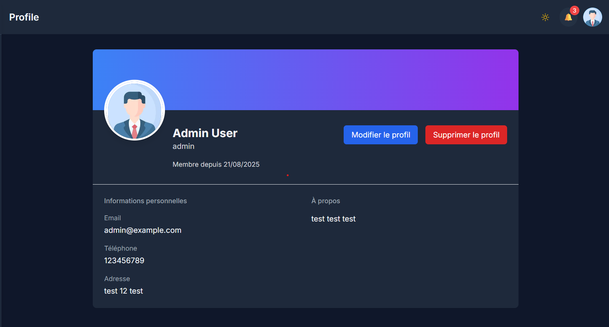              |
| Role Management      | 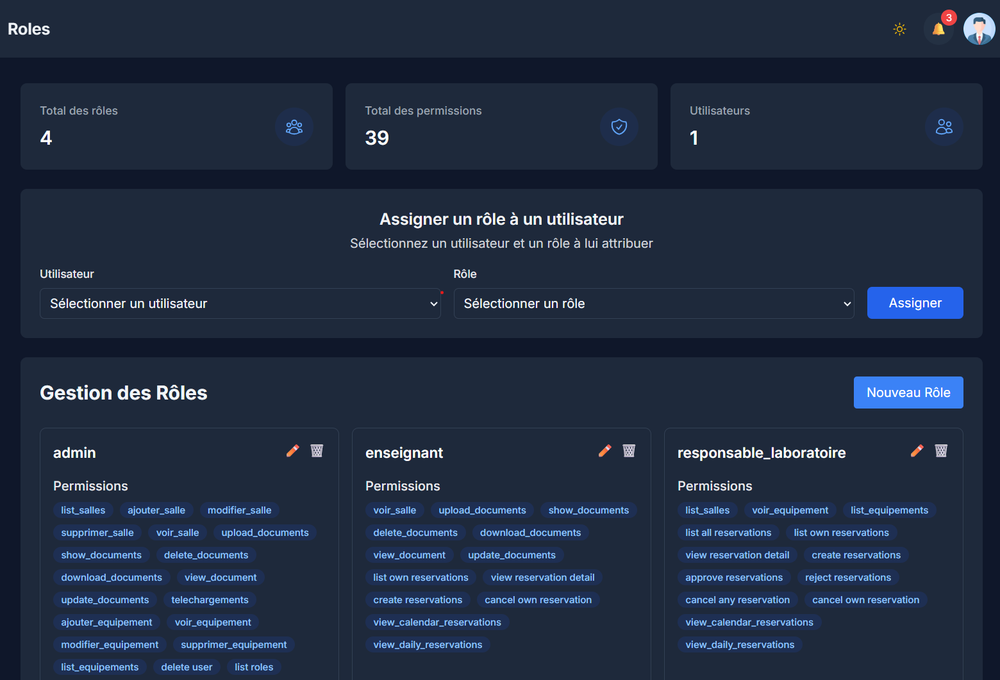         |
| Document Single_page | 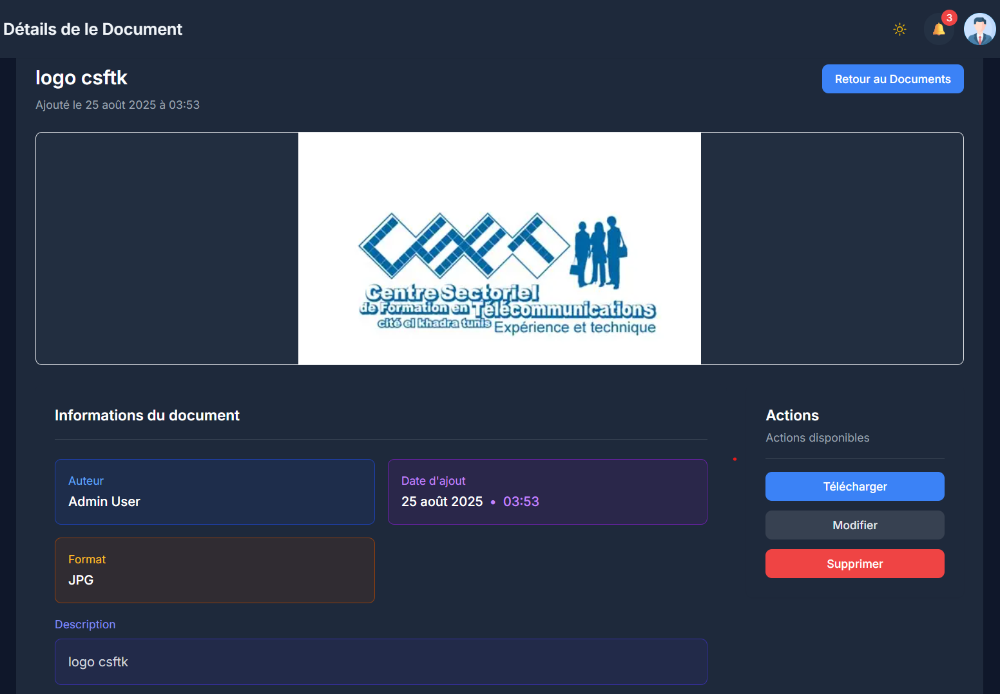         |

---

## 🧠 System Architecture & Diagrams

The system's design was modeled using several diagrams to ensure clarity and a solid foundation:

- **Use Case Diagrams** — A global diagram provides a high-level overview of system interactions, supplemented by detailed diagrams for each specific user role.
- **Database Schema (MLD)** — A complete relational model mapping all entities, including users, rooms, reservations, and the pivot tables that manage their relationships.
- **UML Class Diagram** — An object-oriented representation of the system's entities, detailing their attributes and methods to align closely with the Laravel Eloquent models.

### Diagrams

| Diagram              | Image                                          |
| -------------------- | ---------------------------------------------- |
| Global Use Case      | 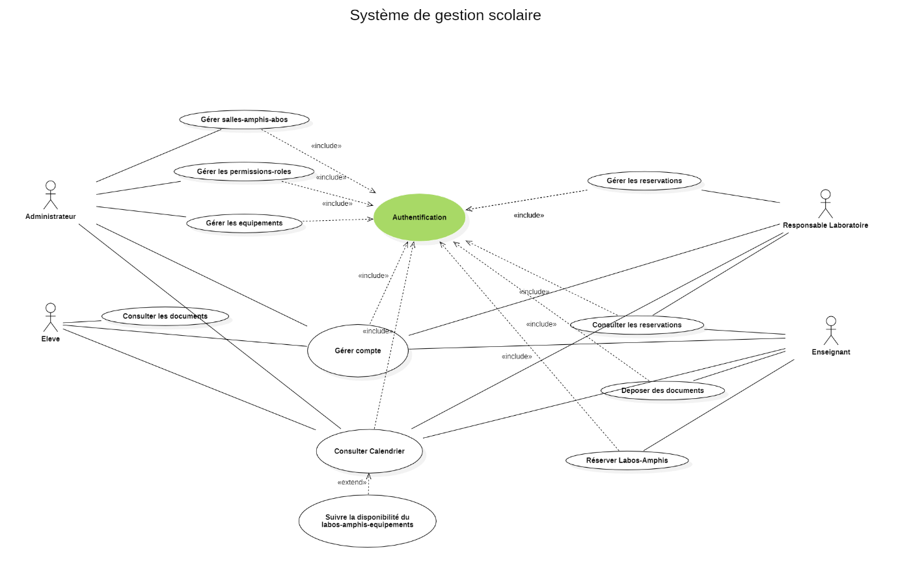  |
| Admin Use Case       | 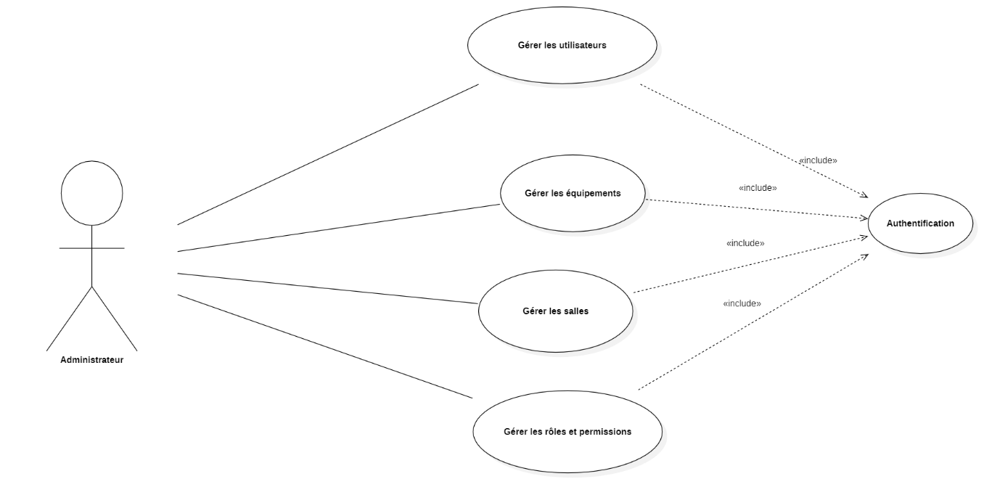     |
| Teacher Use Case     | 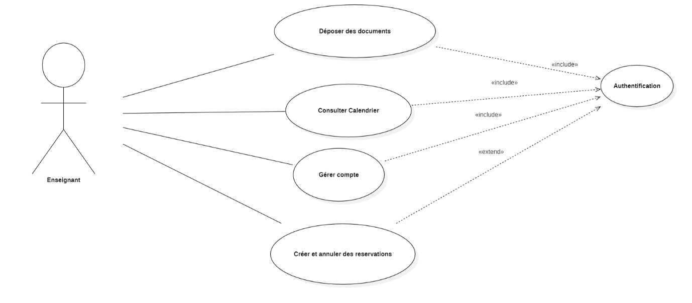 |
| Student Use Case     | 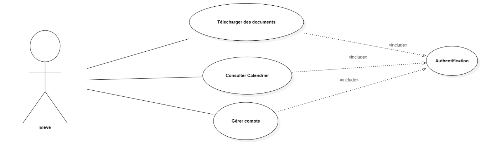 |
| Lab Manager Use Case | 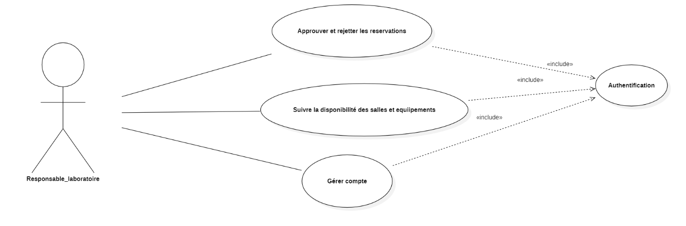 |
| Database Schema      | 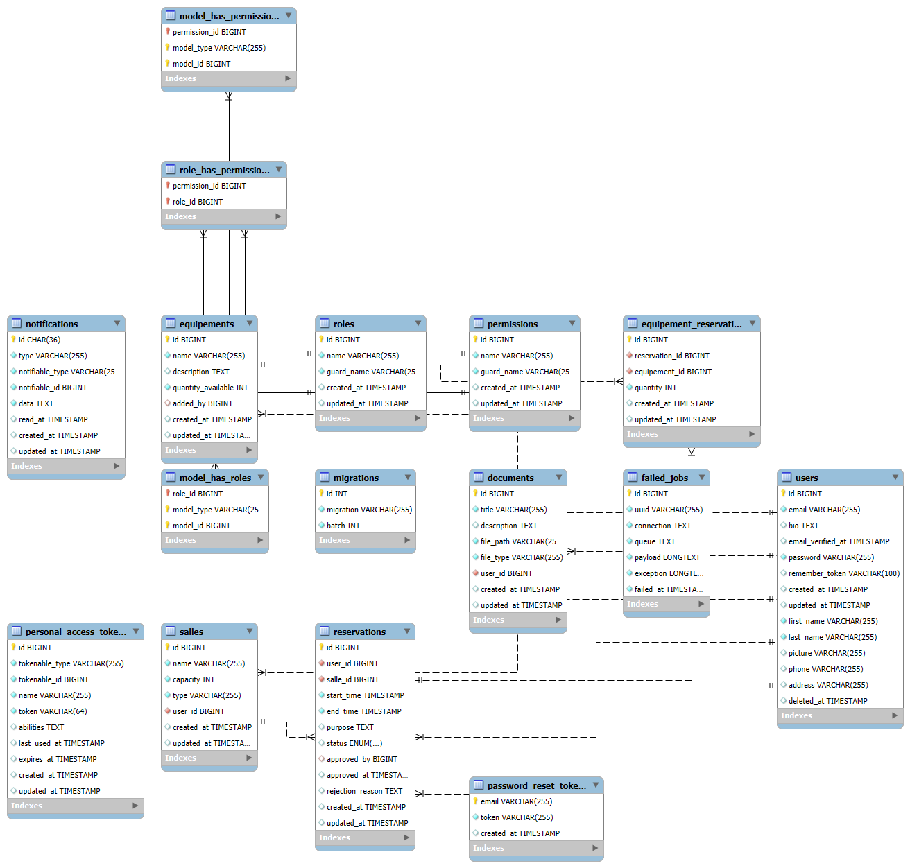   |
| UML Class Diagram    | 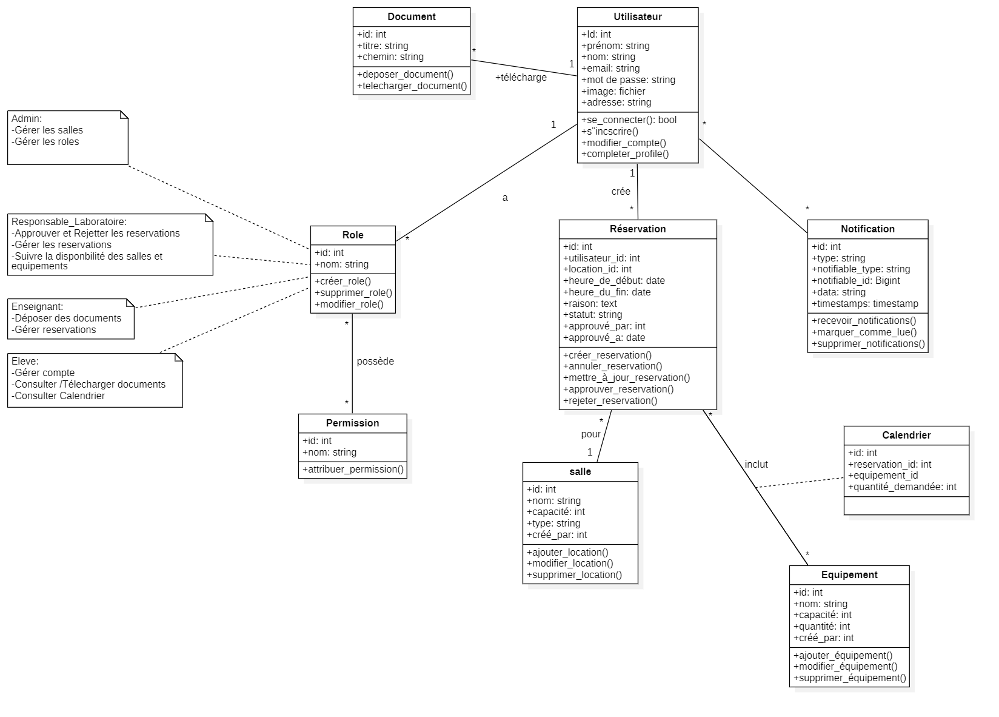     |

---

## 🛠️ Tech Stack

The project is built with modern, robust, and scalable technologies for both the backend and frontend.

### Backend

- PHP ^8.1
- Laravel ^10.10
- Laravel Sanctum ^3.3 (For API Authentication)
- Spatie/laravel-permission ^6.17
- Composer

### Frontend

- Next.js 15.3.2
- React
- Tailwind CSS ^3.4.1
- Axios ^1.9.0 (For API requests)
- React Context (For global state management)
- date-fns ^4.1.0 & react-hot-toast ^2.5.2

### Database

- MySQL

---

## ⚙️ Prerequisites

- PHP >= 8.1
- Composer
- Node.js & NPM
- MySQL

---

## 🧩 Installation

1.  **Clone the repository**

    ```bash
    git clone https://github.com/your-username/EduSpace.git
    cd EduSpace
    ```

2.  **Backend setup**

    ```bash
    cd backend
    composer install
    cp .env.example .env
    # Configure your .env file with database credentials
    php artisan key:generate
    php artisan migrate
    php artisan serve
    ```

3.  **Frontend setup**
    `bash
    cd ../front
    npm install
    cp .env.example .env.local
    # Set the backend API URL (e.g., NEXT_PUBLIC_API_BASE_URL) in .env.local
    npm run dev
    `The frontend will run at:`http://localhost:3000`

---

## 🚀 Usage

--->
Once the installation is complete and both servers are running:

1.  Navigate to the frontend URL: `http://localhost:3000`.
2.  Register a new user account or log in with existing credentials.
3.  Explore the dashboard and available features, which will differ based on the user's assigned role.
4.  Administrators can begin by creating rooms, equipment, and other users.
5.  Teachers can create new reservations via the reservation management module.

---

## 🔮 Future Perspectives

"EduSpace" has strong potential for future growth with several key enhancements planned:

- **📱 Mobile Application Development**: Create a native (iOS/Android) or hybrid mobile app to improve accessibility and enable real-time push notifications.
- **🤖 Artificial Intelligence (AI) Integration**: Introduce an AI module for predictive analytics to forecast high-demand periods for resources, or implement an intelligent chatbot to provide 24/7 user support.
- **📊 Advanced Reporting Module**: Develop a comprehensive analytics dashboard for administrators to track metrics such as room occupancy rates, equipment usage, and other key performance indicators.
- **💳 Payment Gateway Integration**: For institutions that rent their facilities, integrating an online payment gateway could streamline the process and create a new revenue stream.

---

## 🤝 Contributing

Contributions are welcome! Please feel free to open an issue or submit a pull request.

---

## 📄 License

This project is open-source and available to everyone.
